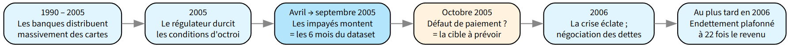
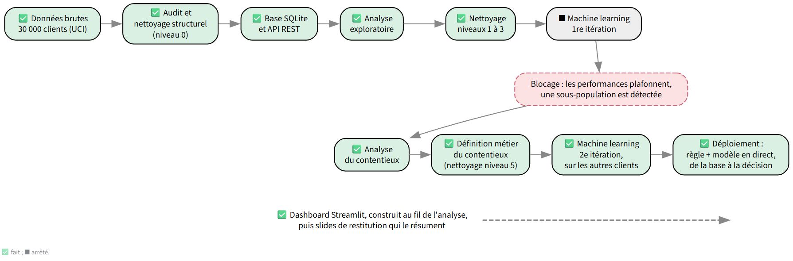

# 🏦 RiskLens ML — Analyse & Prédiction du Défaut de Paiement 💳


🌐 **Le site du projet : [risklens-ml.streamlit.app](https://risklens-ml.streamlit.app/)**. Chaque graphique et chaque chiffre y est recalculé en direct sur les données.

## 📌 Présentation de mon projet de fin de bootcamp
**RiskLens ML** est une mission Data & IA complète visant à transformer des données transactionnelles historiques en un outil d'aide à la décision pour la gestion du risque crédit.
Durée prévue : 7 semaines à partir du 30 août  

Le projet suit un cycle de vie data complet : du diagnostic initial et la structuration d'une base de données relationnelle, à l'exposition des données via une API, jusqu'à la création d'un modèle prédictif et d'un dashboard interactif sous Streamlit.

### 🎯 Problématique
> **"Peut-on prévoir le défaut de paiement d'un client en se basant uniquement sur son comportement transactionnel des 6 derniers mois, malgré un manque d'informations économiques globales ?"**

L'enjeu est de déterminer si les habitudes de paiement et l'utilisation du crédit ainsi que les informations de base d'un client sont des indicateurs suffisamment robustes pour anticiper un défaut, sans deux types d'informations que les banques utilisent d'habitude : les **données de conjoncture** (chômage, inflation, croissance) et les **données économiques du client lui-même** (revenu, autres crédits, loyer, endettement total, reste à vivre), ni score de crédit externe.

### 💥 Le contexte : la crise des *"Card Monsters"* (Taïwan, 2005)
- **L'économie allait bien** : chômage bas, inflation maîtrisée, croissance solide. La crise ne vient pas de l'économie.
- **Les banques ont distribué des cartes sans compter** : 133 cartes pour 100 adultes en 2005, avec des critères d'octroi abaissés et des taux de 17 à 20 % par an, au plafond légal. Beaucoup de clients ne pouvaient plus payer que le minimum chaque mois : on les a surnommés les « esclaves de la carte ».
- **Des clients payaient une carte avec une autre**, en multipliant les cartes dans des banques différentes : c'est la « cavalerie ».
- **En 2005, le régulateur durcit les conditions d'octroi** : la « cavalerie » se grippe et les impayés augmentent fortement au second semestre 2005, avant que la crise n'éclate au grand jour en 2006. **Le dataset couvre avril à septembre 2005, au moment où la vague monte.**


*Les étapes de la crise des cartes de crédit à Taïwan et la place du dataset. Sources détaillées dans la chronologie du [document de contexte](docs/contexte.md).*

### 📚 Le dataset et l'étude de référence
Ce dataset est la base de données publique qui résulte de [l'étude scientifique de I-Cheng Yeh et Che-hui Lien (2009)](docs/DefaultCreditCardClients_yeh_2009.pdf) (traduit en français [ici](docs/traduction_DefaultCreditCardClients_yeh_2009.md)). En pleine crise, une banque taïwanaise a confié aux chercheurs un échantillon anonymisé de 30 000 clients. Cette étude comparait plusieurs modèles pour repérer les clients à risque. Le meilleur, un réseau de neurones, obtenait un score de 0,54, ce qui correspond à un **AUC de 0,77**. L'AUC mesure la capacité d'un modèle à distinguer les bons payeurs des futurs défaillants.

Ma démarche adopte un prisme résolument **orienté métier**. En combinant une compréhension approfondie du jeu de données (le fonctionnement de la banque, de ses codifications et des paiements de l'époque), un nettoyage rigoureux fondé sur des règles métier et une exigence posée avant tout modèle, un **taux de rappel minimal** (le modèle du projet doit trouver au moins une part fixée des défauts), je cherche à optimiser la détection réelle des risques de défaut, garantissant ainsi une performance robuste et réellement actionnable pour la gestion des risques bancaires.

**🚀 Objectif ML Engineer :** Mon but est de dépasser le score de référence de l'étude de 2009 (un AUC de 0,77). En banque, oublier un client à risque (Faux Négatif) coûte bien plus cher que de suspecter un client sûr (Faux Positif).

---

## 🔎 Ce que l'analyse montre
L'analyse est terminée, du nettoyage au déploiement. Voici ses conclusions :
- **Les données** : 30 000 clients d'une banque taïwanaise, suivis d'avril à septembre 2005, en pleine crise des cartes de crédit. 22,1 % font défaut en octobre, un taux bien plus élevé que celui d'un portefeuille bancaire ordinaire.
- **La base de données et l'API** : les données sont rangées dans une base relationnelle et exposées par une API REST, comme dans le système d'information d'une banque.
- **Comprendre le jeu de données** : un fichier complet, mais des anomalies à expliquer avant toute analyse. Les codifications de paiement ne sont pas un fait brut : c'est une étiquette de la banque, mise à jour avec un mois de décalage sur le paiement. Très peu de lignes sont retirées (4 paiements géants, 941 comptes inactifs, 204 plafonds atypiques) : il reste 28 851 clients.
- **L'analyse exploratoire** : le profil des clients ne pèse que modérément sur le risque ; ce sont les comportements qui comptent. Un client qui ne rembourse rien fait défaut à 58 %, un payeur au comptant à 15 %. La dette totale des clients augmente de 32 % en six mois, alors qu'ils n'en remboursent chaque mois que 11 à 12 %. Et le risque grimpe avec les codifications de retard accumulées : de 12 % sans aucune à 76 % pour un retard sur les six mois.
- **La population contentieuse** : des clients figés en retard et un modèle qui plafonnait ont conduit à isoler une sous-population par une **règle métier explicable**, deux codifications de retard d'affilée, soit au moins 90 jours. Sur des clients jamais vus, elle ne retient que 11 % des clients, mais 71 % d'entre eux font défaut, et elle capte ainsi 36 % des défauts, sans aucun modèle.
- **Le machine learning** : sur les autres clients, tous les modèles et toutes les variables atteignent le même plafond. Le modèle retenu, sans aucune donnée démographique, range les clients par niveau de risque, du très haut risque (un client sur deux en défaut) au risque faible (un sur dix). Environ un tiers des défauts ont le profil des bons clients et ne s'annoncent pas dans les données.
- **Le déploiement** : la règle puis le modèle tournent en direct, de la base de données à la décision, sur des clients jamais vus, et retrouvent les résultats de l'évaluation.
- **La réponse** : oui, en partie. Le comportement des six derniers mois prévoit une grande part des défauts et classe les clients par niveau de risque, avec un AUC d'environ 0,79 contre 0,77 pour l'étude : défi relevé, de peu. Il ne désigne pas à coup sûr ceux qui feront défaut.

Détails : [journal du machine learning](lab_ML/tableau_ML.md), [méthodologie](lab_ML/methodologie_ML.md), [hypothèses et conclusions](docs/hypotheses_et_conclusions.md).

#### 🕵️‍♂️ Pour aller plus loin : Les coulisses de la donnée

Pour découvrir comment des détails logistiques de l'époque (comme les règlements en espèces dans les supérettes 7-Eleven, qui créent des décalages dans l'enregistrement des paiements sur les comptes, et des erreurs de saisie) ou les parallèles avec le **Buy Now, Pay Later (BNPL)** actuel éclairent ce projet d'un point de vue purement métier :
📖 [Lire le contexte du projet](docs/contexte.md)

---

## 🛠️ La démarche du projet


Le schéma résume le parcours ; voici le détail de chaque étape, dans le même ordre, avec ses notebooks et ses fichiers.

#### 1. Données brutes, audit et nettoyage structurel
*   Analyse du dataset *Default of Credit Card Clients* (30 000 clients, UCI), formulation de la problématique et identification des limites (manque de données contextuelles).
*   Audit et nettoyage structurel (niveau 0) : [notebook d'audit](src/01_01_audit.ipynb)

#### 2. Base SQLite et API REST
*   Modélisation relationnelle : [schéma de la base](images/schema_bdd__risklens.png) | schéma SQL normalisé, avec des tables de correspondance qui traduisent les valeurs numériques en libellés explicites : [script de création des tables](src/03_02_creation_tables.sql)
*   Chargement des données dans la base : [script d'ingestion](src/03_01_ingestion_donnees.py) | contrôle de cohérence de la base face au fichier : [notebook de test](src/03_03_test_coh%C3%A9rence.ipynb)
*   API avec **FastAPI** : les 4 types d'opérations **CRUD** (Create, Read, Update, Delete), pour accéder aux données et les gérer sans accès direct à la base : [fichier API](src/04_01_api.py)

#### 3. Analyse exploratoire et nettoyage (niveaux 1 à 3)
*   Analyse statistique approfondie (corrélations, tendances) avec Python : [EDA laboratoire](src/05_01_EDA_lab.ipynb)
*   Nettoyage par niveaux cumulatifs, chaque correction justifiée par la logique métier : [notebook de nettoyage](src/02_01_nettoyage.ipynb)
*   Data visualisation pour identifier les facteurs clés du défaut de paiement : [EDA storytelling](src/05_03_EDA_storytelling.ipynb)

#### 4. Machine learning, 1re itération, et le blocage
*   Premiers modèles sur tout le dataset, contentieux compris, à chaque niveau de nettoyage : [archive de la première itération](lab_ML/1ere_iteration/) et son [journal](lab_ML/1ere_iteration/tableau_ML.md).
*   **Le blocage** : les performances plafonnent, et une sous-population de clients figés en retard apparaît. L'itération est arrêtée ; son archive est gardée telle quelle, comme trace des performances de référence.

#### 5. Le contentieux : analyse et définition métier
*   Recherche du périmètre de la population contentieuse, isolée par une règle métier (deux codifications de retard d'affilée, soit au moins 90 jours) : [EDA contentieux](src/05_02_EDA_contentieux.ipynb)
*   Étude dédiée de la codification `PAY_n = 1` (statut provisoire du dernier mois, corrections retenues) : [EDA codification 1](src/05_04_EDA_codification1.ipynb)
*   Corrections de codification et indicateurs du contentieux écrits au niveau 5 du nettoyage : [notebook de nettoyage](src/02_01_nettoyage.ipynb)

#### 6. Machine learning, 2e itération, sur les autres clients
*   Modèles entraînés sur les clients à encours positif, **sans la population contentieuse** (traitée par la règle métier), avec un découpage entraînement / test propre au machine learning : [création des jeux](lab_ML/creation_datasets_ML.ipynb).
*   Six modèles comparés (régression logistique, SVM, KNN, réseau de neurones, RandomForest, CatBoost), puis les quatre meilleurs gardés pour la phase finale (régression logistique, réseau de neurones, RandomForest, CatBoost), réglés par une **boucle automatique de GridSearch** sous contrainte de surapprentissage, en validation croisée à 5 plis ; réglage sur la **précision des défauts prédits** au rappel minimal (60 % des défauts), classement par le score décisionnel F2.
*   Variables ajoutées par scénarios, puis élaguées ; chaque scénario comparé à sa référence pli par pli, les écarts serrés tranchés par une validation croisée répétée : [journal des scénarios](lab_ML/tableau_ML.md).
*   **Version finale** : 21 variables, aucune donnée démographique, CatBoost ; lue **une seule fois** sur le jeu de test, qui confirme la validation : [évaluation finale](lab_ML/evaluation_finale_test.ipynb).
*   **Limites** : analyse des défauts que les modèles manquent et de la cible elle-même : [méthodologie, section 13](lab_ML/methodologie_ML.md).

#### 7. Déploiement : la règle et le modèle en direct
*   La règle du contentieux puis le modèle tournent en direct sur le site, de la base de données à la décision, sur des clients que le modèle n'a jamais vus. Le nettoyage est refait en mémoire, dans l'application : la base n'est jamais modifiée.
*   Trois démonstrations : sur les données du projet ; sur les données brutes lues dans la base par l'API, nettoyage refait en direct ; sur tout le dataset d'origine, avec un modèle entraîné sur les données brutes et 9 niveaux de risque : [préparation des démos 1 et 2](lab_ML/demo_ML/creation_demo_ML.ipynb), [préparation de la démo 3](lab_ML/demo_ML/creation_demo_3.ipynb).
*   L'API s'enrichit d'une lecture par lot (`POST /clients/lot`) et des prédictions enregistrées dans la base (`GET /prediction/{client_id}`).

#### 8. Dashboard Streamlit et slides de restitution
*   Dashboard interactif sous **Streamlit**, construit au fil de l'analyse : chaque graphique et chaque chiffre est recalculé en direct sur les données : [accéder au site](https://risklens-ml.streamlit.app/)
*   Slides de restitution, qui résument le site pour une présentation orale à un public non technique.

---

## 📋 Pilotage du projet
Le suivi rigoureux de la mission est assuré via un tableau **Trello**, mis à jour hebdomadairement pour monitorer l'avancement des étapes et le respect du planning.
*   [lien Trello](https://trello.com/b/OKlbbtCy/risklens-ml)

---

## 🌐 Architecture & Accès en Ligne

Le projet est entièrement déployé dans le cloud selon une architecture découplée (API Backend + Interface Frontend) :

* **🖥️ Interface Utilisateur (Frontend Streamlit) :** [Accéder au site](https://risklens-ml.streamlit.app/)
* **⚙️ Documentation Technique (Backend FastAPI / Swagger UI) :** [Explorer l'API et les routes](https://risklens-ml-api.onrender.com/docs)
* **🤖 Modèles :** enregistrés dans le dépôt ([`lab_ML/demo_ML/`](lab_ML/demo_ML/)), chargés et exécutés par l'application Streamlit ; deux des trois démonstrations lisent les clients dans la base par l'API.
* **🗄️ Base de données :** SQLite, hébergée avec l'API ; elle contient aussi les prédictions enregistrées du modèle entraîné sur les données brutes. Les démonstrations ne font que la lire.

### 🧪 Fonctionnalités à tester sur le site
**La base de données, par l'API**
* **Consultation (GET)** : Requêter les profils clients et leurs historiques de paiement issus de la BDD SQLite.
* **Opérations CRUD (POST / PATCH / DELETE)** : Simuler l'ajout, la modification ou la suppression de dossiers clients en direct.
* **Validation des schémas JSON** : Inspecter la structure des requêtes et les modèles de données (Pydantic).

**Les simulateurs de risque par profil**
* Choisir un profil de client (âge, genre, niveau d'études, statut marital) et lire son taux de défaut de paiement : sur tous les clients étudiés, sur la base lue par l'API, sur la population contentieuse, et sur les clients confiés au machine learning.

**Les démonstrations du modèle**
* **Le système en direct** : injecter un lot de clients que le modèle n'a jamais vus, choisir la part des défauts à détecter (ou la règle du contentieux seule), puis comparer les décisions au défaut constaté ; ou suivre un client, de sa lecture dans la base jusqu'à son niveau de risque.
* **Lecture par lot et prédictions (`POST /clients/lot`, `GET /prediction`)** : lire des milliers de clients en un appel, consulter la prédiction enregistrée d'un client.

> ℹ️ *L'API est hébergée sur l'offre gratuite de Render. Si le serveur est en veille, la première requête peut prendre jusqu'à une minute à répondre.*

---

## ⚙️ Installation
1. **Cloner le dépôt** :
   ```bash
   git clone https://github.com/johan-mac-59/RiskLens_ML
   cd RiskLens_ML
   ```
2. **Installer les dépendances** (via `uv`) :
   ```bash
   uv sync
   ```
3. **Configuration des données** :
   Téléchargez le dataset depuis [Kaggle](https://www.kaggle.com/datasets/mariosfish/default-of-credit-card-clients/data) et placez le fichier CSV dans le dossier `data/raw/`, sous le nom `default of credit card clients.csv` (le nom attendu par `src/02_01_nettoyage.ipynb`).
   Pour reproduire le machine learning : exécuter `src/02_01_nettoyage.ipynb` en entier, puis `lab_ML/creation_datasets_ML.ipynb`, puis les scénarios `lab_ML/ml_0.ipynb`, `ml_1`… dans l'ordre (détail : section 0 de [`lab_ML/methodologie_ML.md`](lab_ML/methodologie_ML.md)).

---

## 🛠️ Stack Technique
* **Langage :** Python (Pandas, NumPy, Uvicorn, Requests)
* **Base de données :** SQLite (Modélisation relationnelle, Foreign Keys)
* **API & Backend :** FastAPI, Pydantic (Validation des schémas JSON, Opérations CRUD, Documentation Swagger UI)
* **Déploiement Cloud :** Render (API Web Service), GitHub (Gestion de versions & Intégration continue)
* **Gestionnaire de paquets :** `uv` (`pyproject.toml`)
* **Data visualisation :** Plotly, Streamlit (dashboard interactif)
* **Machine Learning :** Scikit-Learn, CatBoost
* **Front-end / UI :** Streamlit Cloud

---

## 🔭 Axes d'amélioration

**Quatre informations à obtenir de la banque**, car les limites du projet viennent des données :
*   **La définition exacte du défaut** (`dpnm`) : défaut de paiement observé, ou statut posé par la banque ? Des clients sans dette sont comptés en défaut. C'est la condition de toute amélioration.
*   **Les vrais encours** : le montant du relevé ne serait pas toujours la dette réelle ; on saurait si les défauts « sans dette » sont une erreur de la cible ou une dette invisible dans les relevés.
*   **La liste des clients suivis hors du circuit normal** (recouvrement, contentieux) : elle validerait la règle du contentieux, reconstruite ici à partir des codifications.
*   **La façon dont l'échantillon a été tiré** : avec environ un client sur cinq en défaut, il ne ressemble pas à un portefeuille réel.

**Les pistes ouvertes**
*   **Une probabilité de défaut par client** (calibration), l'objectif principal de l'étude d'origine, plutôt qu'un taux par niveau de risque.
*   **Comprendre la codification `PAY_n = 1`** : si c'est un statut d'attente, un modèle pourrait retrouver la codification définitive (sortie du retard ou retour au retard) ; si c'est une codification à part entière, elle se garde telle quelle. Seule la banque peut trancher.

**Les pistes envisagées puis écartées**
*   **Combiner plusieurs modèles** (vote, moyenne des probabilités) : les quatre modèles retenus trouvent les mêmes défauts, et environ un tiers des défauts ne sont trouvés par aucun ([analyse des défauts manqués](lab_ML/analyse_defauts_manques.ipynb)).
*   **Ajouter encore des variables** : tous les scénarios sont restés dans l'incertitude de la mesure.
*   **Des modèles plus puissants** : ils ne font pas mieux, et un modèle lancé sur les données brutes fait jeu égal avec le projet.
*   **Nettoyer davantage les données** : au-delà des anomalies indéfendables, ce serait remplacer le signal de la banque par notre propre lecture.
*   **Recoder la cible** : les modèles prédiraient notre définition du défaut, et non plus celle de la banque.
*   **Changer de jeu de données** : le pari était de faire mieux par un regard métier sur ces données ; il a payé en partie, avec la règle du contentieux qui prédit à elle seule un tiers des défauts.
*   **Un modèle pour sortir des clients du contentieux** : avec l'exigence métier, ne sortir un client que s'il a au moins neuf chances sur dix de payer (sortir à tort un client en défaut revient à abandonner une créance), aucun modèle ne trouve de client à sortir : au contentieux, ils trient à peine mieux que le hasard.
*   **Isoler l'effet des corrections de codification du contentieux** (niveau 5 du nettoyage) : elles ne modifient les codifications que d'environ 1 % des clients, et l'écart attendu serait plus petit que l'incertitude de la mesure ; les essais du comparatif ne montrent déjà que des écarts minimes.
*   **Réentraîner le modèle sur l'entraînement et le test réunis** : un gain dans le bruit, et plus aucun client jamais vu pour juger le modèle et le montrer en direct.

Raisonnement complet : page « Les recommandations » du [site](https://risklens-ml.streamlit.app/) et [hypothèses et conclusions](docs/hypotheses_et_conclusions.md).
